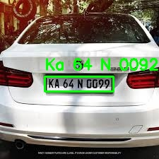
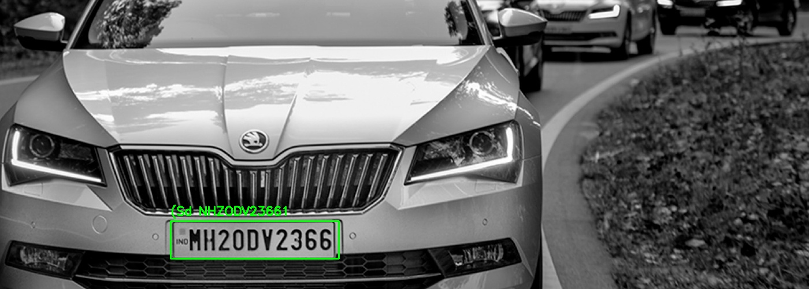
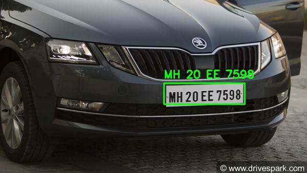
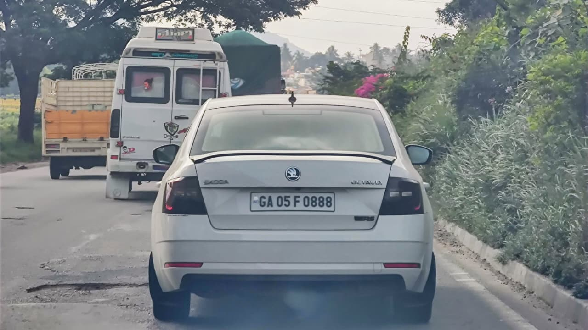
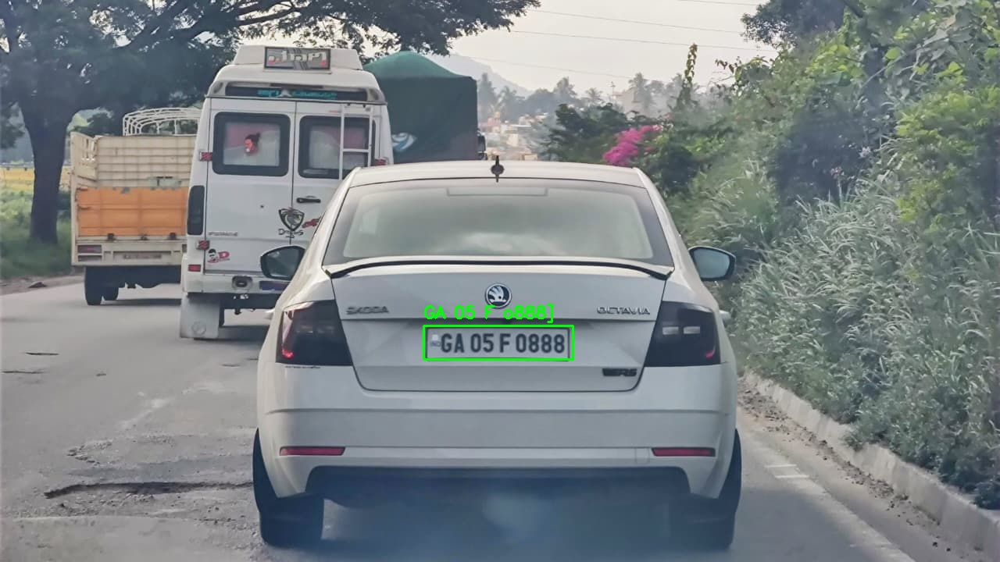
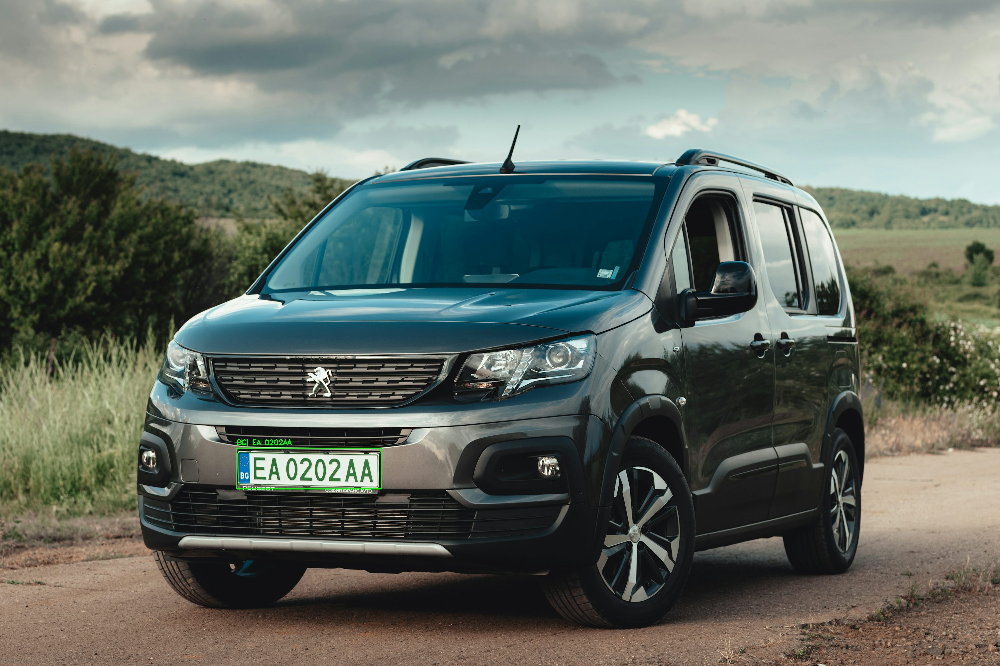

# Smart Parking System  
### Occupancy Detection + License Plate ANPR (Dwell Time Logging)

This project implements a **two-module intelligent parking system** combining **computer vision**, **deep learning**, and **OCR-based license plate recognition**.

The goal is to automate:
- **Parking bay occupancy detection**
- **Vehicle identification using license plates**

The system includes **real-time processing**, **batch ANPR**, and **complete documentation** of methodology, experiments, and results.

---

# 🚗 **Project Overview**

### **Module 1 — Parking Occupancy Detection**
Uses:
- Predefined **parking bay polygons**
- Lightweight CNN classifier / image differencing
- Frame-by-frame status logging (occupied / free)

Applications:
- Smart parking dashboards  
- Occupancy analytics  
- Space availability systems  

---

### **Module 2 — License Plate Detection & ANPR**
Pipeline:
1. **YOLOv8** → License plate detection  
2. **Plate cropping**  
3. **OCR** (PyTesseract primary, EasyOCR optional baseline)  
4. **Text extraction**  
5. **Dwell time calculation** per vehicle  

Outputs are logged to:
`` logs/events.csv ``

---

# 📂 **Repository Structure**

```
smart-parking/
│
├── parking/ # Occupancy detection module
├── plates/ # YOLO-based plate detection + OCR
├── app/ # Demo applications (video + webcam)
│ └── demoAI.py
│
├── anpr_results/ # Detection outputs, crops, and OCR results
│ ├── crops/
│ └── detections/
│
├── docs/ # Full academic project documentation
│ ├── 01_introduction.md
│ ├── 02_state_of_the_art.md
│ ├── 03_method_design.md
│ ├── 04_experiments_results.md
│ └── 05_discussion_limitations.md
│
├── images/ # Raw input images (for docs & ANPR testing)
├── logs/ # Dwell time & detection records
│ └── events.csv
│
└── README.md # Main landing page 
```

---

# 🚀 **Quick Start**

### 1. Create virtual environment
```
python -m venv .venv
source .venv/bin/activate        # Windows: .venv\Scripts\activate
Install Python dependencies
pip install -r requirements.txt
```

3. Install Tesseract OCR Engine

Linux: ``` sudo apt install tesseract-ocr ```

macOS:  ```brew install tesseract ```

Windows: Install from: https://github.com/UB-Mannheim/tesseract/wiki

▶️ Run ANPR Demo (Plates + Dwell Time)

``` python app/demoAI.py ```

Outputs:

```
logs/events.csv
anpr_results/detections/
anpr_results/crops/

```
🔍 Run Batch ANPR on a Folder of Images
```
python anpr_batch.py
```

This generates:

Cropped plates

Detection images

``` anpr_results/results.csv ``` with plate text and confidence


📘 Documentation
Full academic documentation is available under:

📁 docs/
```
Chapter	Description
01 — Introduction	Project goals, motivation
02 — State of the Art	Literature review & existing methods
03 — Method & System Design	YOLOv8 pipeline + OCR + occupancy
04 — Experiments & Results	Detection results, comparisons, ANPR outputs
05 — Discussion & Limitations	Analysis and future work
```
Direct link:
🔗 View Documentation Folder

📸 Sample Results
Detection + OCR (ANPR):

## Input vs Output Comparison (YOLOv8 + ANPR)

The table below shows the original input images (left) and the corresponding YOLOv8 detection results (right).  
This gives a clear visual understanding of how the model processes and transforms real-world images.

### **Comparison Table**

| Input Image | YOLOv8 Detection Output |
|-------------|--------------------------|
|  |  |
|  |  |
|  |  |
|  |  |
|  |  |


Download separately:
```
Parking Occupancy: PKLot, CNRPark-EXT

Plate Recognition: CCPD, OpenALPR benchmarks

Place datasets accordingly under project folders.
```

## License
MIT License — free to use, modify, and distribute.

## Project Status
Fully working prototype with:

0. Parking bay occupancy

1. YOLOv8 license plate detection

2. OCR + dwell time logging

3. Batch and real-time processing

4. Complete academic documentation

5. Further improvements planned in segmentation, OCR accuracy, and edge deployment.
