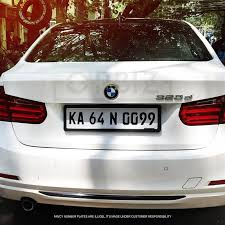
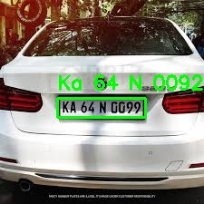
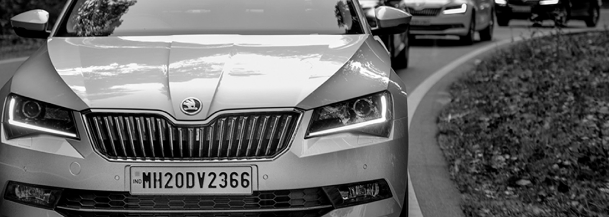
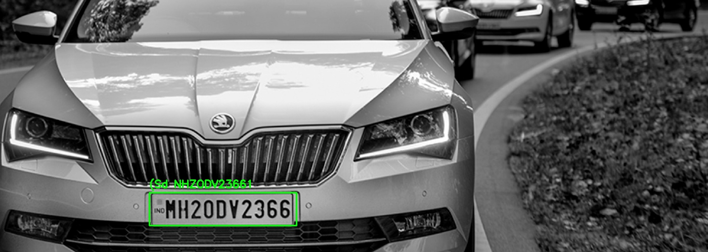
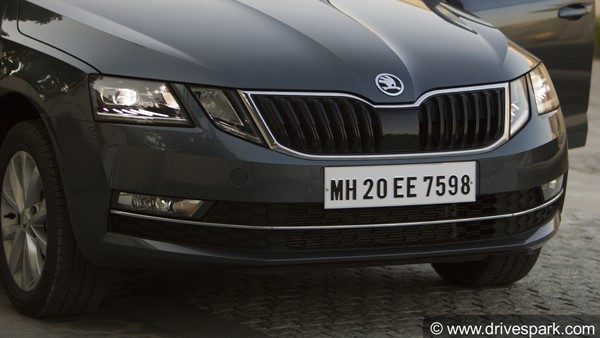
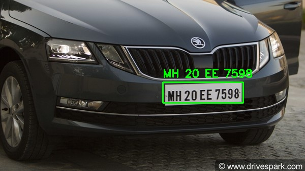
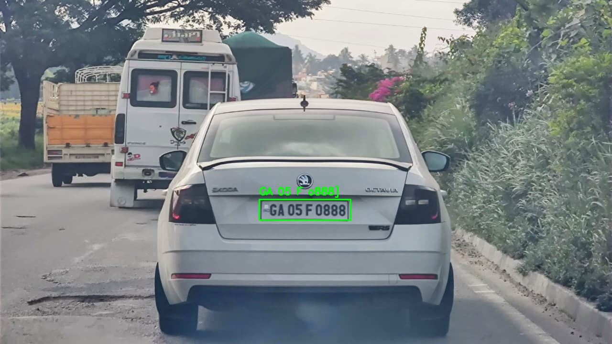

# Smart Parking IoT System  
### Occupancy Detection & License Plate ANPR with Edge AI

This repository presents an **IoT-enabled Smart Parking System** that integrates **edge AI**, **computer vision**, and **optical character recognition (OCR)** to automate parking monitoring and vehicle identification.

The system is designed as a **modular IoT architecture**, where camera nodes perform on-device intelligence and generate structured data that can be transmitted to higher-level parking management platforms.

---

## 🌐 IoT System Motivation

Modern smart cities require:
- Real-time parking availability
- Vehicle identification and dwell-time monitoring
- Low-latency, low-cost edge intelligence

This project demonstrates how **lightweight AI models running on edge devices** (PC / embedded Linux / future Raspberry Pi or Jetson) can be used as **IoT perception nodes** for smart parking infrastructure.

---

## 🧠 System Architecture (IoT Perspective)

### Edge Layer (Perception Node)
Runs locally on the device:
- Camera input
- AI inference
- OCR processing
- Data logging

### Application Layer
- Parking status visualization
- Vehicle dwell-time analysis
- Event logging

### (Future) Cloud / Server Layer
- Aggregation of multiple parking nodes
- Long-term analytics
- Dashboard & alerts

---

## 🚗 Functional Modules

### Module 1 — Parking Occupancy Detection
Detects whether a parking bay is **occupied or free**.

**IoT relevance:**
- Each camera acts as a sensor node
- Outputs binary occupancy status
- Suitable for real-time updates

**Techniques used:**
- Predefined parking bay polygons
- Lightweight CNN / image differencing
- Frame-based status evaluation

---

### Module 2 — License Plate Detection & ANPR (Edge AI)
Performs **Automatic Number Plate Recognition (ANPR)** directly on the edge device.

**Pipeline:**
1. Camera frame acquisition  
2. **YOLOv8** license plate detection  
3. Plate cropping (OpenCV)  
4. **OCR** (EasyOCR / PyTesseract)  
5. Structured output generation  

**Generated data:**
- Plate text
- Detection confidence
- Timestamp
- Vehicle dwell time

---

## 📊 Experimental Results (Edge Inference)

From local inference tests:

- **Total detections:** 90  
- **Unique images processed:** 82  
- **Mean detection confidence:** ~0.73  
- **Maximum confidence:** ~0.92  

The system demonstrates reliable plate detection and OCR extraction under normal lighting and viewing conditions.

📄 Detailed analysis is available in:
```

docs/04_experiments_results.md

```

---

## 📂 Repository Structure

```

smart-parking/
│
├── parking/            # Parking occupancy detection (IoT perception)
├── plates/             # License plate detection + OCR
├── app/                # Edge demo applications
│   └── demoAI.py
│
├── anpr_results/       # Edge-generated outputs
│   ├── crops/          # Cropped license plates
|   ├── plots/          # plotted results
│   └── detections/     # Annotated detection images
│
├── docs/               # Academic documentation
│   ├── 01_introduction.md
│   ├── 02_state_of_the_art.md
│   ├── 03_method_design.md
│   ├── 04_experiments_results.md
│   └── 05_discussion_limitations.md
│
├── images/             # Sample IoT camera inputs
├── logs/               # Event & dwell-time logs
│   └── events.csv
├── src/                # Python files
└── README.md

````

---

## 🚀 Quick Start (IoT Edge Node Setup)

### 1. Create Virtual Environment
```bash
python -m venv .venv
source .venv/bin/activate      # Windows: .venv\Scripts\activate
pip install -r requirements.txt
````

### 2. Install OCR Engine

* **Linux:** `sudo apt install tesseract-ocr`
* **macOS:** `brew install tesseract`
* **Windows:**
  [https://github.com/UB-Mannheim/tesseract/wiki](https://github.com/UB-Mannheim/tesseract/wiki)

---

## ▶️ Run Edge ANPR Node

```bash
python demoAI.py
```

**Edge outputs generated:**

```
anpr_results/detections/
anpr_results/crops/
anpr_results/results.csv
logs/events.csv
```

These outputs can be transmitted to a central server or dashboard in a full IoT deployment.

---

## 🔍 Batch Processing (Offline IoT Mode)

```bash
python anpr_batch.py
```

Processes all images in a folder and generates:

* Annotated detection images
* Plate crops
* OCR results with confidence scores

---

## 📘 Documentation

Full academic and technical documentation is available in:

```
docs/
```

| Chapter                       | Content                             |
| ----------------------------- | ----------------------------------- |
| 01 — Introduction             | Problem definition & motivation     |
| 02 — State of the Art         | Related IoT & vision systems        |
| 03 — Method Design            | Edge AI pipeline design             |
| 04 — Experiments & Results    | Quantitative & qualitative analysis |
| 05 — Discussion & Limitations | Constraints & future work           |

---

## 📸 Sample IoT Edge Results

### **Comparison Table**

| Input Image | YOLOv8 Detection Output |
|-------------|--------------------------|
|  |  |
|  |  |
|  |  |
|  |  |
|  |  |

---

## 📦 Datasets (External)

```
Parking Occupancy:
- PKLot
- CNRPark-EXT

License Plate Recognition:
- CCPD
- OpenALPR benchmarks
```

Datasets are **not included** and must be downloaded separately.

---

## 🔮 Future IoT Extensions

* MQTT / HTTP data publishing
* Multi-camera parking networks
* Edge deployment on Raspberry Pi / Jetson
* Cloud dashboard integration
* Vehicle re-identification across nodes

---

## 📜 License

MIT License — free to use, modify, and deploy.

---

## 📌 Project Status

✅ Functional IoT edge prototype
✅ Real-time & batch ANPR
✅ Occupancy detection
✅ Structured data output
✅ Academic documentation complete

This project serves as a **foundation for scalable smart-parking IoT systems**.

```

