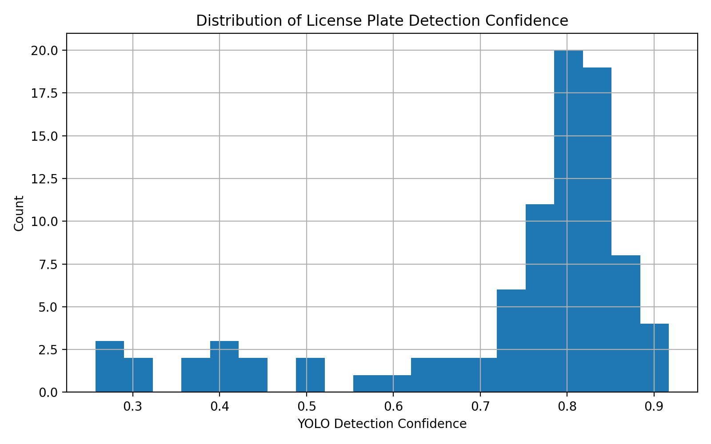
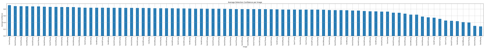
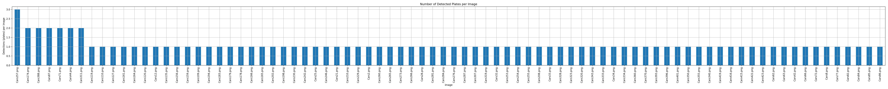
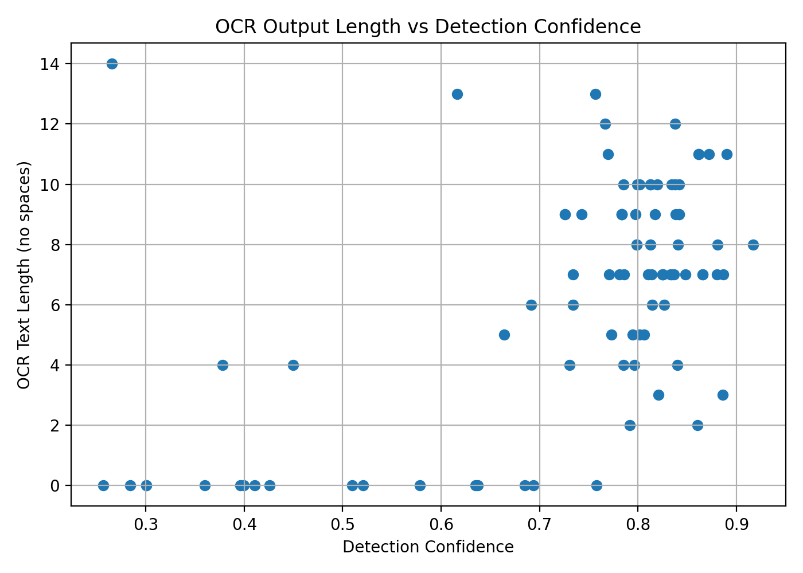

---

# 04 — Experiments & Results

## 4.1 Experimental Setup

This chapter presents the experimental evaluation of the proposed **Automatic Number Plate Recognition (ANPR)** pipeline, which integrates deep-learning–based object detection with optical character recognition (OCR).

**Detection model:** YOLOv8n (Ultralytics), fine-tuned for **single-class license plate detection** (`plate`).
**OCR engine:** EasyOCR (English language model).
**Execution environment:** Local Python environment (CPU-based inference).

### Processing Pipeline

The end-to-end inference pipeline consists of the following stages:

1. License plate detection using YOLOv8
2. Plate region cropping using OpenCV
3. Text extraction from cropped plates using OCR
4. Saving annotated detections, cropped plates, and structured results

### Generated Outputs

After execution, the following outputs are produced:

```
anpr_results/
├── detections/   # Annotated images (bounding box + confidence + OCR text)
├── crops/        # Cropped license plate regions
├── plots/        # plotted results
└── results.csv   # Structured ANPR results
```

---

## 4.2 YOLOv8 Detection Training Performance

The YOLOv8 model was trained and validated on a license-plate dataset in YOLO format.
Final validation metrics reported by the Ultralytics framework are:

* **mAP@0.50:** ≈ 0.90
* **mAP@0.50–0.95:** ≈ 0.55
* **Inference speed:** ~2.5 ms/image (GPU during training validation)

### Interpretation

The high **mAP@0.50** score indicates strong plate localization performance.
The lower **mAP@0.50–0.95** is expected due to the small physical size of license plates and the stricter IoU thresholds used in this metric.

These results confirm that YOLOv8n provides a good balance between accuracy and computational efficiency for ANPR tasks.

---

## 4.3 ANPR Inference Summary (Detection + OCR)

To evaluate real-world usability, the trained detector was applied to a batch of test images, followed by OCR on detected plate crops.

### Statistical Summary (from `results.csv`)

* **Total detections:** 90
* **Unique images with detections:** 82
* **Mean detection confidence:** 0.7308
* **Median detection confidence:** 0.7969
* **Minimum confidence:** 0.2570
* **Maximum confidence:** 0.9172

### High-Confidence Examples

Images achieving the highest average detection confidence include:

* `Cars33.png` → 0.9172
* `Cars210.png` → 0.8902
* `Cars254.png` → 0.8865

### Observation

The majority of detections lie in the **0.75–0.85 confidence range**, indicating reliable plate localization.
Lower-confidence detections typically correspond to challenging conditions such as motion blur, poor lighting, skewed angles, or partial occlusion.

---

## 4.4 Quantitative Analysis of Inference Results

To further analyze model behavior, multiple plots were generated from the inference results.

### 4.4.1 Distribution of Detection Confidence



This histogram shows that most detections cluster around high confidence values, with a small tail of low-confidence detections.

---

### 4.4.2 Average Detection Confidence per Image



This plot illustrates per-image detection reliability and highlights images where detection performance is strongest or weakest.

---

### 4.4.3 Number of Plates Detected per Image



Most images contain a single detected plate, while a small number include multiple vehicles.

---

### 4.4.4 OCR Output Length vs Detection Confidence



Higher detection confidence generally correlates with longer and more complete OCR outputs, validating the dependency between accurate localization and text recognition.

---

## 4.5 Input vs Output Comparison (YOLOv8 + ANPR)

This section presents a qualitative comparison between **raw input images** and **processed outputs** generated by the ANPR system.

### **Comparison Table**

| Input Image | YOLOv8 Detection Output |
|-------------|--------------------------|
|  |  |
|  |  |
|  |  |
|  |  |
|  |  |

### What the Output Shows

Each output image includes:

* A bounding box around the detected license plate
* A confidence score produced by YOLOv8
* OCR-extracted text overlaid near the plate (if enabled)

This comparison clearly demonstrates the transformation from raw visual input to structured semantic information.

---

## 4.6 Example End-to-End Output (CSV)

All detection and OCR results are stored in a structured CSV file:

```
anpr_results/results.csv
```

Example entries:

```csv
image,crop,text,confidence
Cars33.png,Cars33_plate_0.jpg,KA64NGG99,0.9172
Cars210.png,Cars210_plate_0.jpg,DL03AB5544,0.8902
```

This format enables easy post-processing, analytics, and integration with parking management systems.

---

## 4.7 Local Execution and Reproducibility

To reproduce the experiments locally:

```bash
pip install ultralytics opencv-python easyocr matplotlib pandas
python plot_training_result.py
```

All results are automatically saved under:

```
anpr_results/
```

---

### Chapter Summary

The experimental results demonstrate that the proposed system:

* Achieves strong detection accuracy with a lightweight model
* Produces reliable OCR results for clear license plates
* Operates efficiently in a fully local environment

This validates the feasibility of deploying the system as a real-time ANPR component in smart parking applications.

---
